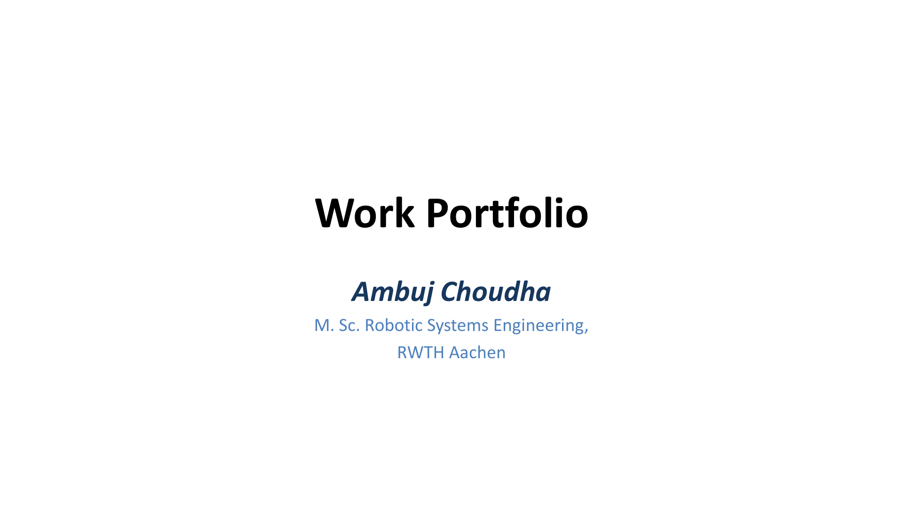
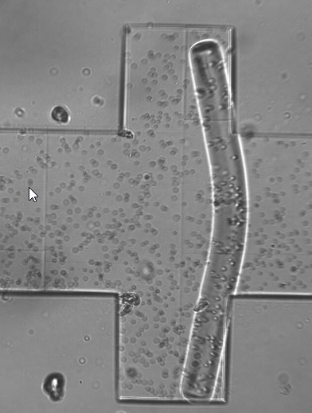

# 👋 Hi, I'm Ambuj Choudha

I build **end-to-end Computer Vision and ML systems**, from model selection and training pipelines through to deployment on CPU and edge hardware. My background spans applied research and hands-on experience with sensors and prototypes across four RWTH institutes, so I can navigate both a paper and a production codebase.

**What I bring to a team:**
- **Turning research viable** : 4× runtime speedup via parallelisation, automated mesh generation pipelines, and a prototype for automating Textile QA coupled with a Neural Network

- **Automating annotation & cutting costs** : built SAM-based semi-automated labelling tool and a full UDA pipeline (12 models, 150+ papers reviewed) to reduce manual labelling in deep learning-based defect detection at [Fraunhofer IPT](https://www.ipt.fraunhofer.de/)

- **Inference under constraints** : deployed YOLOv10 at 46 FPS on CPU-only hardware via ONNX Runtime, building a zero-copy DeepStream pipeline targeting NVIDIA Jetson

🔗 [LinkedIn](https://www.linkedin.com/in/ambuj-choudha/)

## 🎓 Education

**Master of Science in Robotic Systems Engineering**
*RWTH Aachen University, Germany* | Grade: 2.1/4.0 *(German scale : equivalent to Good)*

**Bachelor of Technology in Production Engineering (with Honours)**
*College of Engineering Pune, India* | GPA: 8.33/10.0

## 📂 Previous Work

A short deck walks through projects done at various RWTH Institutes while working as a student research assistant (Studentische Hilfskraft).

<table>
  <tr>
    <td align="center" valign="middle" width="55%">
      
       
      <i>Previous Works (click to open the PDF)</i>
    </td>
    <td align="center" valign="middle" width="45%">
      
       
      <i>Human-in-the-loop annotation workflow</i>
    </td>
  </tr>
</table>

## 🚀 Core Skillset

- **Programming Languages:** Python, C++, C, MATLAB, Julia
- **ML Frameworks:** PyTorch, TensorFlow, scikit-learn
- **Libraries:** NumPy, Pandas, OpenCV, Matplotlib
- **Robotics Middleware & Backend:** ROS2, FastAPI, SQL
- **MLOps & Deployment:** MLFlow, Docker, ONNX
- **Version Control & CI/CD:** Git, GitHub Actions
- **Simulation & 3D Modelling:** VeroSim, Gazebo, Blender, SolidWorks

## 📬 Let's Connect

- 💼 [LinkedIn](https://www.linkedin.com/in/ambuj-choudha/)
- 📧 Email : ambuj.choudha@rwth-aachen.de
- 📍 Based in Aachen, Germany

Open to full-time roles in Computer Vision, ML, and Robotics Software integration

*Interested in collaborations on Computer Vision, Robotics, or ML projects? Feel free to reach out!*
